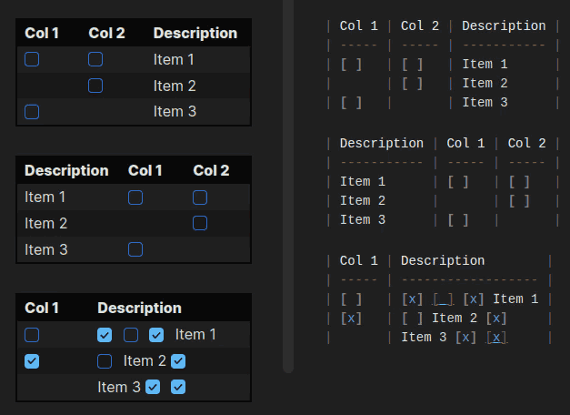

# Table Checkbox Renderer (Revamped)

> **Private revamp.** This is a personal rewrite of [Table Checkbox Renderer](https://github.com/dannns/obsidian-table-checkbox-renderer) by
> [Daniel Aguerrevere](https://github.com/dannns), maintained by [axelcypher](https://github.com/axelcypher)
> for my own use. It is not published in the Obsidian community plugin directory.
> All credit for the original plugin goes to its author. Please report issues with this
> version here, not upstream.

## What's different in this revamp

- **Live Preview support:** checkboxes inside tables are clickable in Live Preview, not only in Reading View. A click edits the note through the editor, so it can be undone with Ctrl+Z.
- **Safe mapping:** cells that are being edited, inline code, and cells whose rendered text doesn't match the source are left untouched.
- **Plugin identity:** own plugin ID `axlc-table-checkbox-renderer-revamped` and name *Table Checkbox Renderer (Revamped)*.
- **Release workflow:** streamlined build & release workflow shared with my other revamps.

## Overview

Enables interactive checkboxes inside Markdown tables. When you click a checkbox in Reading View or Live Preview, the plugin updates the underlying Markdown source, keeping your table and file in sync. It supports multiple checkboxes per cell and works robustly for any table layout.

## Demo

## Features

- Interactive checkboxes in Markdown tables, in Reading View **and Live Preview**.
- Supports multiple checkboxes per cell and per row.
- Changes are immediately saved to the Markdown file.
- Robust mapping between rendered checkboxes and source Markdown.
- Works with any table structure, including complex layouts.

## Usage

- Install the plugin in Obsidian.
- Create a Markdown table with checkboxes (e.g. `[ ]`, `[x]`).
- Click checkboxes in Reading View or Live Preview to toggle them.
- In Source mode, checkboxes stay plain text (`[ ]` / `[x]`).

## Installation

### Manual

1. Download `main.js` and `manifest.json` from the [latest release](https://github.com/axelcypher/obsidian-table-checkbox-renderer/releases/latest).
2. Copy them into `.obsidian/plugins/axlc-table-checkbox-renderer-revamped/` inside your vault.
3. Enable **Table Checkbox Renderer (Revamped)** in **Settings → Community plugins**.

### BRAT

Add `axelcypher/obsidian-table-checkbox-renderer` as a beta plugin in [BRAT](https://github.com/TfTHacker/obsidian42-brat).

### Switching from the original plugin

This revamp uses its own plugin ID (`axlc-table-checkbox-renderer-revamped`), so it installs next to the original instead of replacing it.
Disable the original, copy its `data.json` into `.obsidian/plugins/axlc-table-checkbox-renderer-revamped/` if you want to keep your settings, then enable this version.

## How It Works

- The plugin parses the rendered table and the original Markdown source.
- For each table row, it matches checkboxes in each cell to the corresponding checkbox in the source line using a global index.
- When a checkbox is toggled, the plugin updates the correct `[ ]` or `[x]` in the Markdown file.
- In Live Preview, a CodeMirror view plugin finds `[ ]` / `[x]` in rendered tables, replaces them with checkboxes and toggles them through an editor transaction (undoable with Ctrl+Z).

### Development

- Edit the TypeScript source files in the project directory.
- Install npm `npm install`.
- Run `npm run build` after making changes to produce the updated plugin files.
- Load the plugin in Obsidian's community plugins folder for testing.

## License

MIT. Original work © Daniel Aguerrevere, modifications © axelcypher.
